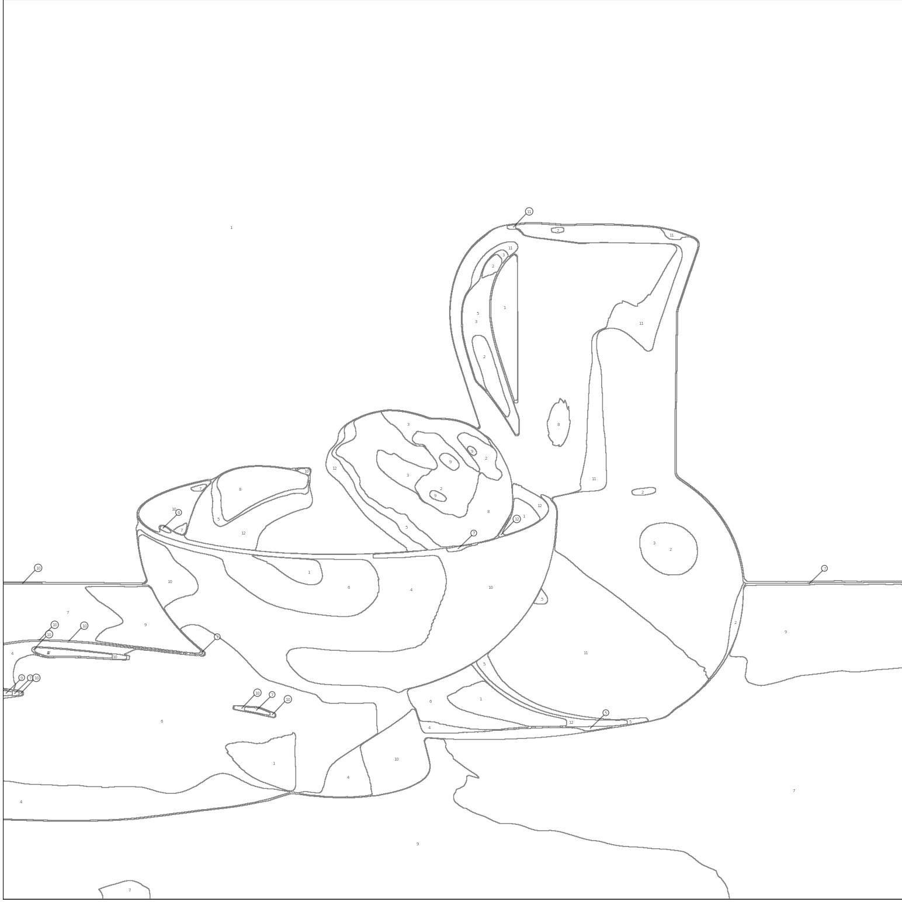

# Paint by Numbers Project

This package can be used to convert any image into a printable Paint-by-numbers. The package can be installed using `pip install pbn`. The package requires and uses `matplotlib`, `numpy`, `opencv-python`, `sklearn`, and `python-polylabel`, which will also be installed when using `pip install pbn`.Then the package can be used as follows:

```python
from pbn.paint_by_numbers import PaintByNumbers

pbn_obj = PaintByNumbers(img_path=f"../images/{image}.jpg", num_of_colors=12)
processed_img = pbn_obj.image_preprocessing()
quantised_img = pbn_obj.quantise_image(img_array=processed_img)
outlined_img = pbn_obj.outline_and_label_image()
```
The package methods are seperated into `image_preprocessing()`, `quantise_img()`, and `outline_and_label_image()` so that each step can easily be replaced by your own code.

The `image_preprocessing()` method smoothens the image and removes noise without loosing too much information from the image such as the borders between different objects in the image. This method significantly improves the quality of the resulting paint-by-numbers.

The `quantise_image()` method quantises the image into the specified number of colors by `num_of_colors` input when creating the object.

Lastly, the `outline_and_label_image()` uses the quantised image and color labels to create an outlined image and labels each section with a number that corresponds to one of the colors found during the quantisation of the image. The method also generates a legend image showing the colors that each number corresponds to.

More detailed information about how the package works can be found in the jupyter notebook in `./notebooks/paint_by_numbers.ipynb` in this repository.

The below images shows the raw image, quantised image, and paint-by-numbers created using this package:



